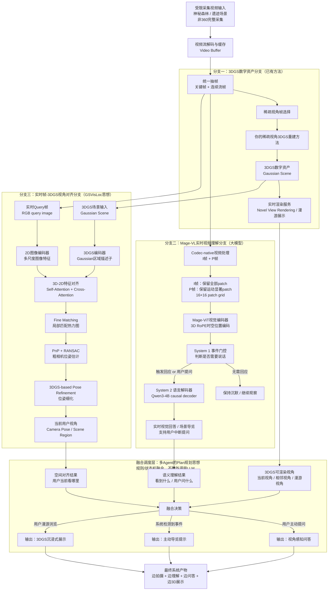

> 由仓库外 `毕设.md` 复制入仓，原文可仍保留在 `/root/autodl-tmp/毕设.md`。

论文题目：受限采集下的3DGS三位重建方法以及在文化遗产数字展示中的应用研究

核心方法贡献：受限采集条件下的3DGS重建；在3DGS重建得到3D资产的基础上，构建了一个面向游客新轨迹的空间感知（3D资产）+ 问答交互/资产拖拽展示 系统

- 系统先把“拍不全的文化遗产”3D重建成 可自由观看的3D资产
- 游客拿拍摄设备（手机）拍摄现场时，系统既知道“他看到了什么”，也知道“他在3D资产里看的是哪里”，把静态数字资产变成 可交互的数字导览 
- 系统（展示价值）：为验证所建 数字资产 在文化遗产数字展示中的应用价值

三大块任务：Mage负责“看懂”，产出语义理解 → 定位负责“对上”产出当前视角/区域 → 3DGS负责“呈现”产出3DGS资产

最后融合 三路 融合，变成 可问答、交互（导览/3D漫游） 系统

- **想了解 → AI讲解/问答**
- 想细看 → 进入3DGS场景自由换视角看

# 总体设计流程图

三路“各自作用”“设计核心：“让 实时视频问答 与 已经重建的3D文化遗产资产 发生空间关联”

3DGS重建 - 给景区建立一个“数字世界”

- 输入：关键帧 + 相机参数
- 输出：3D模型（只用于展示，不会理解游客的问题和实时视频）、
  - 3D资产的作用：让 实时视频问答 和 “这个已经重建好的具体遗产（3D资产形式）” 对应起来

Mage视频理解问答- 负责 语义交互， 给系统一双“会看、会听、会回答的眼睛”

 资产定位 - 把 流式输入（游客手机/其他摄像设备） 和 数字世界（3D资产） 对应起来

- 现实中正在看的地方 ↔ 3DGS里对应的地方

现实中的手机视角挂回你已经建立的3D资产坐标系
